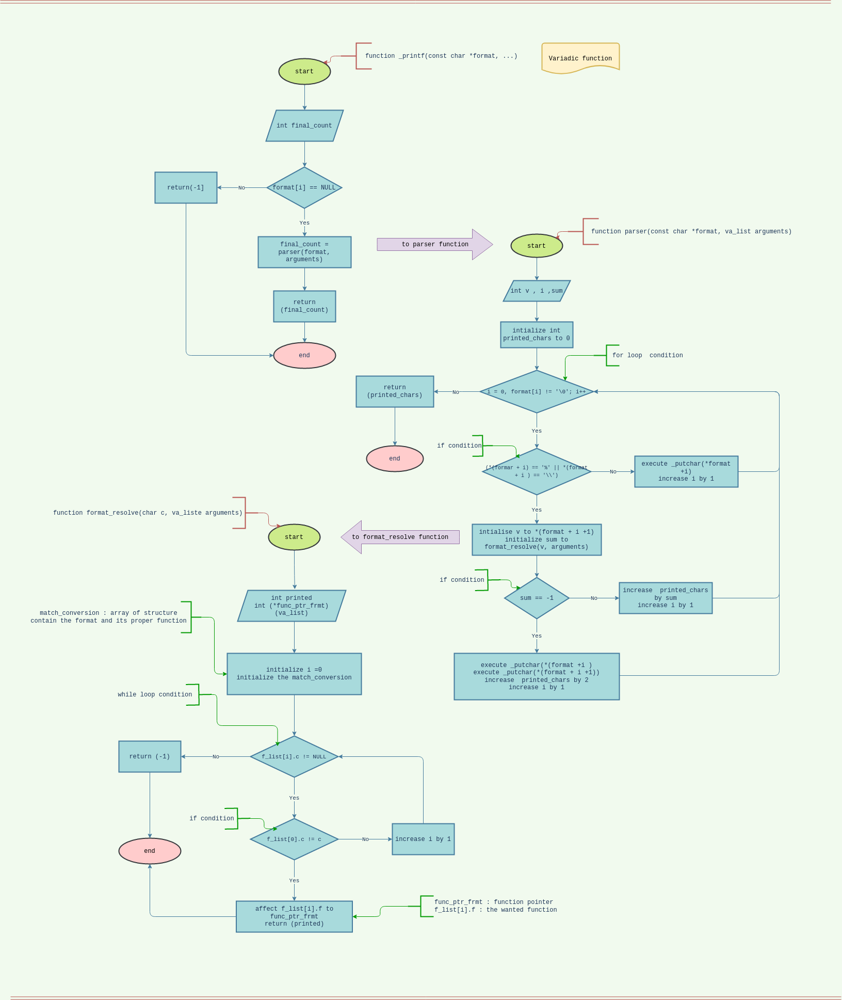

# Printf function

## About this Project
This is a group project for [holberton school](https://www.holbertonschool.com/tn/en/).<br>
The purpose is to write our own printf function using C language.<br>
In addition, designing our custom formatting specification for any occasion.

## Purpose
The purpose of this project is to Combine the knowledge we gained through doing various C exercices in a single tool 

## Usage:
In order to use our printf function follow the next steps:
1. Clone the repository


2. Create your own main.c file or use our's where you make the call for _printf:
[main.c](../main/test/main.c)
3. compile with this command:
```
$gcc -Wall -Werror -Wextra -pedantic *.c
```

## Function Design
<br>

## Todo list:

1. Handle the following flag characters (+, #, space)

2. Handle length modifier l, h

3. fix the format **%b** bug 

## Authors
Boufaden Ala<br>
Kaabi Ahlem
